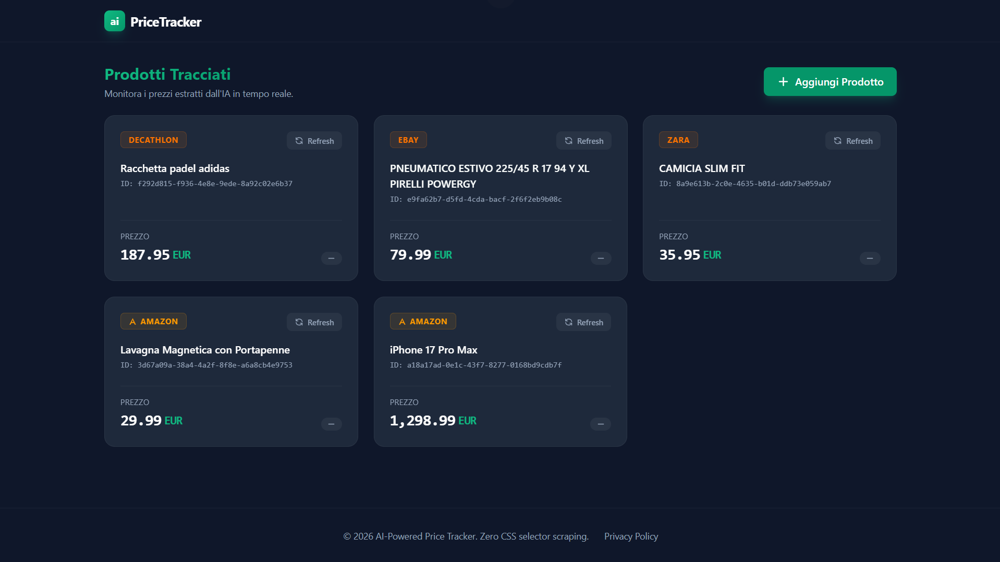
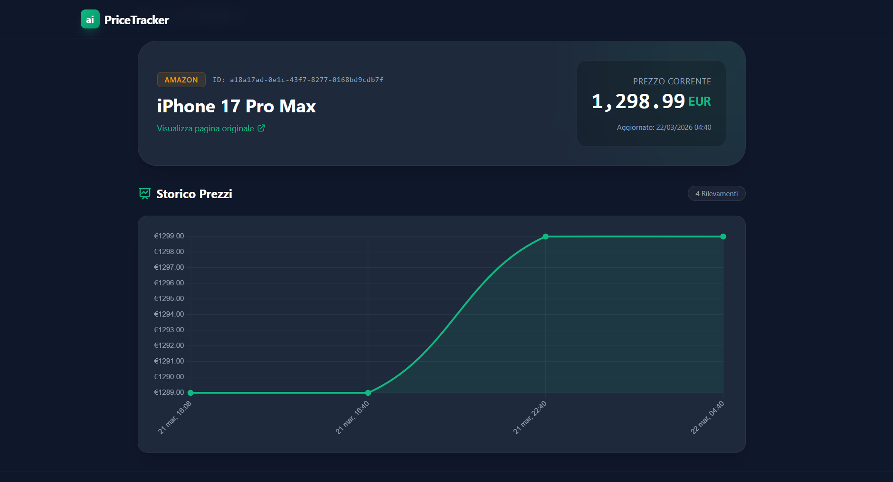

# AI Price Tracker 🚀

A highly resilient, serverless e-commerce price tracking platform powered by AI.

This application allows users to track product prices across any e-commerce website. Instead of relying on fragile CSS selectors, the backend leverages **Puppeteer** to extract raw page text and **Groq (LLaMA 3)** to intelligently parse and structure the product data.

## 📸 Screenshots




## ✨ Features

- **Universal Web Scraping**: Agnostic scraping engine that extracts `document.body.innerText` without relying on fragile or domain-specific HTML selectors.
- **AI Data Extraction**: Utilizes **Groq** via the blazing fast `llama-3.3-70b-versatile` model to parse raw text into structured JSON, intelligently bypassing captchas and blocks.
- **Telegram Notifications**: Multi-user integration to send instant push notifications when a significant price drop (>= 15%) is detected.
- **Serverless Architecture**: Fully scalable backend running on **AWS Lambda**, **API Gateway**, and **EventBridge**, defined via AWS SAM.
- **Dynamic Error Handling**: Resilient frontend alerting users gracefully when the AI detects a bot-protection block or incomplete data.

## 🛠️ Tech Stack

### Frontend
- **Angular 17+** (Standalone Components)
- **Tailwind CSS** (Glassmorphism & Modern UI)
- **RxJS** (State management & API streams)

### Backend
- **Node.js 20.x** (TypeScript)
- **AWS Serverless Application Model (SAM)**
- **AWS Lambda & API Gateway** (REST API)
- **Amazon EventBridge** (Cron jobs for price refresh)

### Database
- **Amazon DynamoDB** (Products & Price History tables)

### AI & Scraping
- **Puppeteer Core** (Headless browser extraction)
- **Groq SDK** (LLaMA 3 inference engine)

## 📁 Project Structure

```text
ai-price-tracker/
├── backend/                  # AWS SAM Serverless Backend
│   ├── src/
│   │   ├── functions/        # Lambda Handlers (addProduct, getProducts...)
│   │   ├── models/           # Shared TypeScript Interfaces
│   │   ├── services/         # Puppeteer & Groq AI Logic
│   └── package.json
├── frontend/                 # Angular Web Application
│   ├── src/
│   │   ├── app/
│   │   │   ├── core/         # ApiService & Interceptors
│   │   │   ├── features/     # Dashboard, ProductDetails, AddProduct
│   │   └── environments/     # API Endpoints configuration
│   └── ...
└── template.yaml             # AWS CloudFormation Stack Definition
```

## 🚀 Getting Started / How to Run

### Prerequisites
- Node.js (v20+)
- Angular CLI (`npm i -g @angular/cli`)
- AWS CLI & SAM CLI
- A free **Groq API Key** and a **Telegram Bot Token**

### 1. Clone the repository
```bash
git clone https://github.com/yourusername/ai-price-tracker.git
cd ai-price-tracker
```

### 2. Install Dependencies
```bash
# Install backend dependencies
cd backend
npm install

# Install frontend dependencies
cd ../frontend
npm install
```

### 3. Environment Configuration
**Backend**: Create an `env.json` in the `backend/` directory for local SAM testing, mapping variables like `GROQ_API_KEY`.
*(Do not commit this file to version control!)*

**Frontend**: The project uses Angular environments. Check `frontend/src/environments/environment.ts` and ensure the API URL points to your local SAM endpoint (`http://127.0.0.1:3000`) or your deployed AWS API Gateway.

### 4. Running Locally

**Start the Angular Frontend:**
```bash
cd frontend
ng serve
```
Navigate to `http://localhost:4200/`.

**Run AWS Backend Locally:**
```bash
cd backend
npm run build
cd ..
sam local start-api --env-vars backend/env.json
```

### 5. Deploy to AWS
To deploy the infrastructure to AWS, authenticate with the AWS CLI and run:
```bash
sam build
sam deploy --guided
```

## 📄 License

This project is licensed under the MIT License - see the LICENSE file for details.
